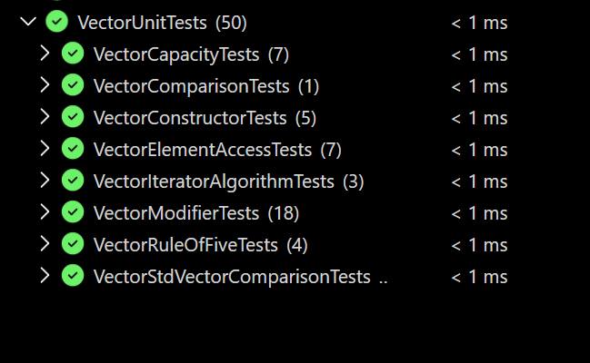

# Studentu pazymiu skaiciavimo programa

## Reikalavimai

Norint paleisti programa, reikia tureti:

- C++ kompiliatoriu su C++17 palaikymu;
- CMake;
- Git;
- Visual Studio, jeigu norima paleisti unit testus per `Test Explorer`;
- Doxygen, jeigu norima sugeneruoti dokumentacija;
- Inno Setup, jeigu norima sugeneruoti diegimo faila.

---

## Programos atsisiuntimas

Projektas atsisiunciamas is GitHub:

```bash
git clone https://github.com/Boljerr/OOP_3.git
cd OOP_3
```

---

## Programos kompiliavimas su CMake

Projektas kompiliuojamas naudojant CMake.

```bash
mkdir build
cd build
cmake ..
cmake --build . --config Release
```

Paleidziamas failas paprastai sukuriamas:

```text
build/Release/Studentai.exe
```

---

## Programos paleidimas

Is `build` aplanko:

```bash
./Release/Studentai.exe
```

Windows aplinkoje programa taip pat galima paleisti per Visual Studio arba tiesiog atidaryti sugeneruota `.exe` faila.

---

## Programos meniu

```text
1 - Rankinis ivedimas
2 - Generuoti tik pazymius
3 - Generuoti studentus ir pazymius
4 - Nuskaityti is failo
5 - Generuoti studentu faila
6 - Atlikti failo kurimo tyrima
7 - Atlikti v0.4 duomenu apdorojimo tyrima(vector)
8 - Atlikti v1.1 konteineriu tyrima
9 - Atlikti v1.1 skirstymo strategiju tyrima
10 - Testuoti Studentas klase
11 - Atlikti v3.0 duomenu apdorojimo tyrima(mano Vector)
12 - Atlikti std::vector ir Vector push_back tyrima
13 - Palyginti std::vector ir mano Vector su studentu failu
14 - Baigti
```
---

## v3.0 nuosavas Vector konteineris

v3.0 versijoje sukurtas nuosavas sabloninis konteineris `Vector<T>`, kuris veikia panasiai kaip `std::vector`.

Konteineris realizuotas naudojant dinamini masyva. Viduje saugomi trys pagrindiniai laukai:

- `T* duomenys_` - rodykle i dinamini masyva;
- `std::size_t dydis_` - dabartinis elementu kiekis;
- `std::size_t talpa_` - rezervuota vieta elementams.

Kai `push_back()` metu nebelieka vietos naujam elementui, konteinerio talpa padidinama ir seni elementai perkeliami i nauja masyva.

---

## Realizuotos Vector funkcijos

Realizuotos pagrindines `std::vector` tipo funkcijos:

- `Vector()`
- `Vector(size_t kiekis)`
- `Vector(size_t kiekis, const T& reiksme)`
- `Vector(std::initializer_list<T>)`
- kopijavimo konstruktorius
- kopijavimo priskyrimo operatorius
- perkelimo konstruktorius
- perkelimo priskyrimo operatorius
- destruktorius
- `size()`
- `capacity()`
- `empty()`
- `max_size()`
- `operator[]`
- `at()`
- `front()`
- `back()`
- `data()`
- `begin()`
- `end()`
- `cbegin()`
- `cend()`
- `reserve()`
- `resize()`
- `shrink_to_fit()`
- `push_back()`
- `pop_back()`
- `clear()`
- `insert()`
- `erase()`
- `assign()`
- `swap()`
- `emplace_back()`
- `emplace()`
- `operator==`
- `operator!=`

---

## Vector funkciju pavyzdziai

### 1. `push_back()`

```cpp
Vector<int> v;

v.push_back(1);
v.push_back(2);
v.push_back(3);
```

Rezultatas:

```text
1 2 3
```

### 2. `at()`

```cpp
Vector<int> v = { 4, 5, 6 };

std::cout << v.at(1);
```

Rezultatas:

```text
5
```

Jeigu indeksas yra uz ribu, `at()` meta `std::out_of_range` isimti.

### 3. `insert()`

```cpp
Vector<int> v = { 1, 4 };

v.insert(v.begin() + 1, { 2, 3 });
```

Rezultatas:

```text
1 2 3 4
```

### 4. `erase()`

```cpp
Vector<int> v = { 1, 2, 3, 4 };

v.erase(v.begin() + 1);
```

Rezultatas:

```text
1 3 4
```

### 5. `resize()`

```cpp
Vector<int> v = { 1, 2 };

v.resize(5, 9);
```

Rezultatas:

```text
1 2 9 9 9
```

### 6. Iteratoriai ir `std::sort()`

```cpp
Vector<int> v = { 3, 1, 2 };

std::sort(v.begin(), v.end());
```

Rezultatas:

```text
1 2 3
```

---

## `push_back()` spartos tyrimas

Buvo matuojama, kiek vidutiniskai laiko uztrunka tuscia `std::vector<int>` ir tuscia `Vector<int>` uzpildyti naudojant `push_back()`.

Buvo atlikta 10 bandymu. Lenteleje pateikiamas vidurkis.

| Elementu kiekis | std::vector vid. laikas, s | Vector vid. laikas, s |
|---:|---:|---:|
| 10 000 | 0.000178740 | 0.000053870 |
| 100 000 | 0.000558310 | 0.000396890 |
| 1 000 000 | 0.004688730 | 0.003114310 |
| 10 000 000 | 0.042939080 | 0.034631990 |
| 100 000 000 | 0.451623300 | 0.313787700 |

Siame teste mano `Vector` buvo greitesnis uz `std::vector`, nes mano realizacijoje talpa didinama dvigubinant, todel buvo maziau atminties perskirstymu. `std::vector` talpos didinimo strategija priklauso nuo konkrecios STL realizacijos.

---

## Atminties perskirstymu skaicius

Perskirstymas buvo skaiciuojamas tada, kai pries `push_back()` buvo tenkinama salyga:

```cpp
capacity() == size()
```

Buvo uzpildoma 100 000 000 `int` elementu.

| Konteineris | Perskirstymu skaicius |
|---|---:|
| std::vector | 47 |
| Vector | 28 |

Mano `Vector` perskirstymu atliko maziau, nes talpa buvo didinama dvigubinant.

---

## Studentu programos tyrimas su std::vector ir Vector

Buvo palygintas studentu programos veikimas naudojant `std::vector` ir mano `Vector`.

Naudoti nustatymai:

- galutinis balas skaiciuotas pagal vidurki;
- studentai rusiuoti pagal galutini rezultata;
- naudotas skirstymas su `std::stable_partition`;
- kiekvienam failui atlikti 3 bandymai;
- lenteleje pateikiami laiku vidurkiai.

| Studentu kiekis | Konteineris | Nuskaitymas, s | Skirstymas, s | Rusiavimas, s | Isvedimas, s | Bendras laikas, s |
|---:|---|---:|---:|---:|---:|---:|
| 100 000 | `std::vector` | 0.499839 | 0.015915 | 0.021947 | 0.094470 | 0.633464 |
| 100 000 | `Vector` | 0.530764 | 0.018053 | 0.022191 | 0.093264 | 0.665642 |
| 1 000 000 | `std::vector` | 4.841230 | 0.152808 | 0.225936 | 0.856493 | 6.091330 |
| 1 000 000 | `Vector` | 4.954550 | 0.173366 | 0.223980 | 0.831624 | 6.199703 |
| 10 000 000 | `std::vector` | 49.436967 | 1.674317 | 2.427917 | 9.419157 | 63.118733 |
| 10 000 000 | `Vector` | 51.044167 | 1.422003 | 2.283997 | 8.322230 | 63.281300 |

Rezultatai rodo, kad studentu programoje `std::vector` ir mano `Vector` veike labai panasiai. `std::vector` buvo siek tiek greitesnis bendrame rezultate, nes tai standartines bibliotekos optimizuotas konteineris. Mano `Vector` veikia teisingai su tais paciais duomenimis, bet jo realizacija yra paprastesne.


---

## Unit testai

Testams naudojamas **Visual Studio C++ Unit Test Framework**.

Testai pateikti faile:

```text
StudentasUnitTests/VectorUnitTests.cpp
```

Testai suskirstyti i kelias grupes:

- `VectorConstructorTests`;
- `VectorCapacityTests`;
- `VectorElementAccessTests`;
- `VectorRuleOfFiveTests`;
- `VectorModifierTests`;
- `VectorIteratorAlgorithmTests`;
- `VectorComparisonTests`;
- `VectorStdVectorComparisonTests`.

Testais patikrinta:

- `Vector` konstruktoriai;
- `Vector` kopijavimas;
- `Vector` perkelimas;
- `push_back()`;
- `pop_back()`;
- `clear()`;
- `reserve()`;
- `resize()`;
- `shrink_to_fit()`;
- `insert()`;
- `erase()`;
- `assign()`;
- `swap()`;
- palyginimo operatoriai;
- iteratoriai;
- veikimas su `std::sort()`;
- veikimas su `Studentas` objektais;
- keliu `std::vector` ir `Vector` funkciju rezultatu palyginimas.

Visi unit testai praejo sekmingai.

Unit testu rezultatu ekrano nuotrauka:



Testai paleidziami per Visual Studio:

1. Atidaryti projekta su Visual Studio.
2. Virsutiniame meniu pasirinkti `Test`.
3. Atidaryti `Test Explorer`.
4. Paspausti `Run All Tests`.

---


## Testavimo failai

Installerio testavimui pateikiami failai:

```text
test_files/studentai10000.txt
test_files/studentai100000.txt
```

---

## Doxygen dokumentacija

Projektas dokumentuotas naudojant **Doxygen**.

Dokumentacijoje aprasytos klases:

- `Zmogus`;
- `Studentas`;
- `Vector<T>`.

Sugeneruota dokumentacija pateikiama:

| Dokumentacijos tipas | Vieta projekte |
|---|---|
| HTML | `docs/html/index.html` |
| LaTeX | `docs/latex/` |
| PDF | `docs/refman.pdf` |

---

## Diegimo failas

Programos diegimui parengtas Inno Setup scenarijus:

```text
installer/setup.iss
```

Diegimo failas idiegia programa i:

```text
C:/Program Files/VU/Ignas-Simaitis
```

Diegimo failo kurimas:

1. Sukompiliuoti programa `Release` rezimu.
2. Atidaryti `installer/setup.iss` su Inno Setup.
3. Paspausti `Compile`.
4. Sugeneruojamas `Setup.exe`.

---

## Versiju aprasas

### v3.0

Sukurta nuosava `Vector<T>` klase ir pritaikyta studentu programai.

Pagrindiniai pakeitimai:

- sukurta sablonine `Vector<T>` klase;
- realizuota dauguma pagrindiniu `std::vector` funkciju;
- `Studentas` namu darbu pazymiams naudoja `Vector<int>`;
- sukurta programos versija su `Vector<Studentas>`;
- atlikti `std::vector` ir `Vector` spartos tyrimai;
- suskaiciuoti atminties perskirstymai;
- prideti `Vector` unit testai;
- `Vector.h` itrauktas i Doxygen dokumentacija;
- parengtas Inno Setup diegimo scenarijus.

---

### v2.0

Sioje versijoje projektas papildytas unit testais ir Doxygen dokumentacija.

Pagrindiniai pakeitimai:

- prideti unit testai `Studentas` klasei;
- patikrinti Rule of Five metodai;
- patikrinti ivesties ir isvesties operatoriai `>>` ir `<<`;
- sugeneruota Doxygen HTML dokumentacija;
- sugeneruota Doxygen LaTeX dokumentacija;
- parengtas dokumentacijos PDF failas;
- atnaujintas `README.md` failas;
- patikrintas projekto kompiliavimas su CMake.

---

### v1.5

Sioje versijoje programa papildyta paveldejimu.

Buvo sukurta abstrakti bazine klase `Zmogus`, is kurios paveldi `Studentas` klase.

Programa islaiko v1.2 versijos logika: veikia Rule of Five, ivesties ir isvesties operatoriai bei ankstesni testai.

---

### v1.2

Sioje versijoje `Studentas` klase papildyta Rule of Five realizacija.

Prideta:

- destruktorius;
- kopijavimo konstruktorius;
- kopijavimo priskyrimo operatorius;
- perkelimo konstruktorius;
- perkelimo priskyrimo operatorius.

Taip pat realizuoti ivesties ir isvesties operatoriai `>>` ir `<<`.

---

### v1.1

Sioje versijoje `Studentas` struktura pakeista i klase.

Pagrindiniai pakeitimai:

- `Studentas` struktura pakeista i klase;
- studentu duomenys perkelti i privacius laukus;
- prideti getteriai ir setteriai;
- realizuoti konstruktoriai ir destruktorius;
- atnaujintos funkcijos, kurios dirba su `Studentas` objektais;
- atliktas `struct` ir `class` versiju palyginimas;
- atlikta analize su `O1`, `O2` ir `O3` optimizavimo flag'ais.

---

### v1.0

Sioje versijoje pridetas darbas su trimis konteineriais:

- `std::vector`;
- `std::list`;
- `std::deque`.

Taip pat buvo pridetas studentu skirstymas i dvi grupes, atliktas konteineriu tyrimas ir paruostas `CMakeLists.txt`.

---

### v0.4

Sioje versijoje pridetas studentu failu generavimas, studentu skirstymas i dvi grupes ir pradinis veikimo spartos tyrimas su `std::vector`.

---

### v0.3

Sioje versijoje patobulinta ivesties validacija, pridetas klaidu tikrinimas ir kodas isskaidytas i `.h` ir `.cpp` failus.

---

### v0.2

Sioje versijoje pridetas duomenu nuskaitymas is failo ir studentu rusiavimas.

---

### v0.1

Sioje versijoje realizuotas rankinis studentu duomenu ivedimas ir galutinio balo skaiciavimas pagal vidurki arba mediana.

---

### v.pradine

Sukurta pradine studento duomenu struktura ir realizuotas pradinis vidurkio bei medianos skaiciavimas.